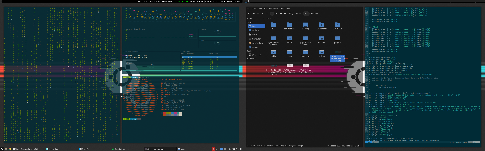

# dotfiles

## To Set Up

### Window Manager

* Install i3-gaps: 
 
 ```
 sudo add-apt-repository ppa:kgilmer/speed-ricer
 sudo apt-get update
 sudo apt install i3-gaps-wm
 ```
* Set i3 as the window manager for lxqt: go to LXQt Settings->Basic Settings, click the dropdown under "Window Manager" and choose i3. 
* Copy i3/config to ~/.config/i3/config
* Install i3-blocks: `sudo apt install i3blocks`
* Install feh: `sudo apt install feh`
* Create a folder in ~/Pictures called Wallpapers and drop any pictures you would like to use as wallpapers there (I used the two included ubuntu wallpapers)
* Copy i3exit and blurlock scripts from i3/scripts to /usr/bin
* Install xidlehook:
  * First install nix package manager: `curl -L https://nixos.org/nix/install | sh`
  * Then use nix to install xidlehook: `nix-env -iA nixpkgs.xidlehook`
* Install imagemagick: `sudo apt install imagemagick`
* Install i3-resurrect: `pip3 install --user i3-resurrect`
* Go to LXQt settings->Session Settings and uncheck "ask for confirmation to leave session"
* Copy picom.conf to ~/.config
* Install picom:
  * Clone the github repo: `https://github.com/yshui/picom` 
  * Install build tools: `sudo apt install libxext-dev libxcb1-dev libxcb-damage0-dev libxcb-xfixes0-dev libxcb-shape0-dev libxcb-render-util0-dev libxcb-render0-dev libxcb-randr0-dev libxcb-composite0-dev libxcb-image0-dev libxcb-present-dev libxcb-xinerama0-dev libxcb-glx0-dev libpixman-1-dev libdbus-1-dev libconfig-dev libgl1-mesa-dev  libpcre2-dev  libevdev-dev uthash-dev libev-dev libx11-xcb-dev meson`
  * Build picom from source: 
 
    ```
    git submodule update --init --recursive
    meson --buildtype=release . build
    ninja -C build 
    ```

  * Install picom to your system: `ninja -C build install`

### Terminal

* Install zsh: `sudo apt install zsh`
* Change your user shell to zsh: `chsh -s /usr/bin/zsh`
* Install urxvt: `sudo apt install rxvt`
* Copy .Xdefaults to ~
* Clone the oh-my-zsh repo `https://github.com/ohmyzsh/ohmyzsh` and run oh-my-zsh/tools/install.sh
* Copy the Ubuntu Mono derivative Powerline.ttf font to ~/.local/share/fonts
* Install powerline: `pip3 install --user powerline`
* Copy .zshrc to ~
* Install vim-gtk: `sudo apt install vim-gtk`
* copy .vimrc to ~
* Install Vundle from git repo `https://github.com/VundleVim/Vundle.vim`, open vim, and type :PluginInstall, then press enter
* Install programs that you want completion for (look at the YouCompleteMe readme for details) and run .vim/bundle/YouCompleteMe/install.py

### Session

* Lubuntu 20.04
* Download the Papirus icon theme:
    
    ```
    sudo add-apt-repository ppa:papirus/papirus
    sudo apt update
    sudo apt install papirus-icon-theme
    ```
    
* open lxqt-settings->Appearance->Icons Theme and choose Papirus-Dark
* Install Font-awesome: `sudo apt install fonts-font-awesome`
* Download the latest release of the Solarized SDDM Theme from github (`https://github.com/MalditoBarbudo/solarized_sddm_theme/releases/tag/0.1.8` as of the time of this writing)
* Extract the folder and rename it to solarized_sddm_theme, then move the folder to /usr/share/sddm/themes
* Edit /etc/sddm.conf and make it so it reads like 
 
    ```
    [Autologin]
    Session=Lubuntu
    [Theme]
    Current=solarized_sddm_theme
    ```

* Install Kvantum: `sudo apt install qt5-style-kvantum qt5-style-kvantum-themes`  
* Open lxqt-settings->Appearance->Themes and select "kvantum-dark" as the QT theme and "Arc-Darker" as the GTK2 and GTK3 theme
* Download the Harmony kvantum theme from `https://store.kde.org/p/1368234` and unzip it
* Open kvantummanager, click select a kvantum theme folder and select the harmony folder, then click "Install this theme", then click "Change/Delete Theme" and select "Harmony" in the selector, then click "Use this theme"

## Screenshot


